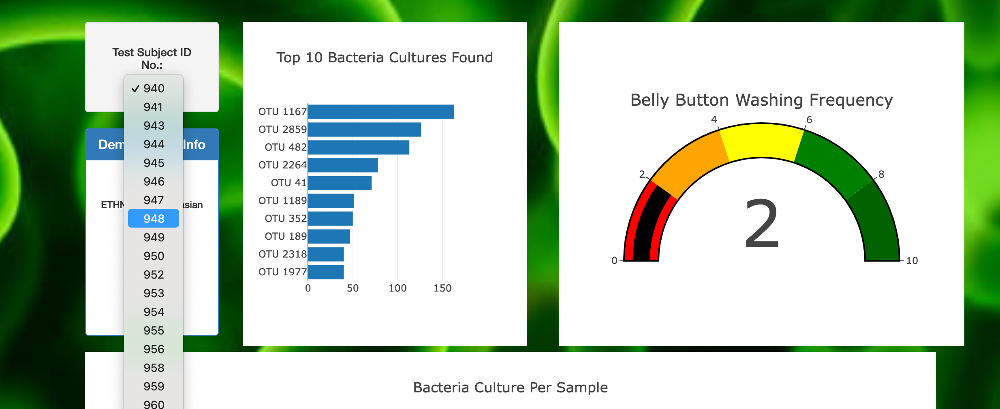
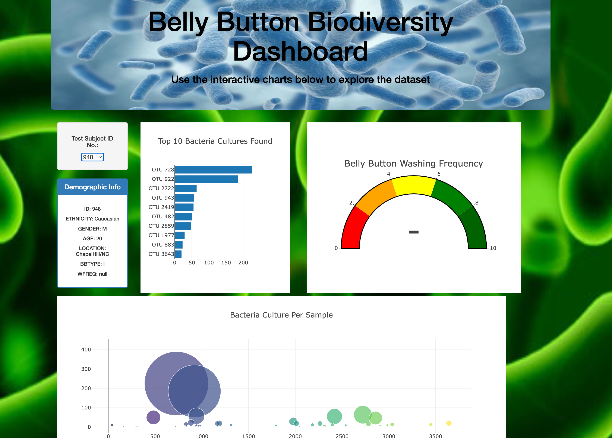

# Belly-Button-Diversity

## Overview

This webpage visualizes data of bacterial samples, which were extracted from the navels of over 100 participants. The goal is to determine which navel-residing bacteria are in sufficient abundance for use in a novel branch of scientific research, which aims to mass-produce certain bacteria for creating meat-alternative food products. Such research will ultimately broaden vegetarian and vegan food options, as well as feed the world's growing population without increasing society's carbon footprint, unlike the meat industry.

## Images

The webpage initially displays as seen in the following image. Data for the first subject, ID 940, is shown by default when the page is first uploaded.

To change the sample displayed, click the dropdown menu under "Test Subject ID No." and click the id of your choosing.

Then, the page reloads with plots for the chose id. 

